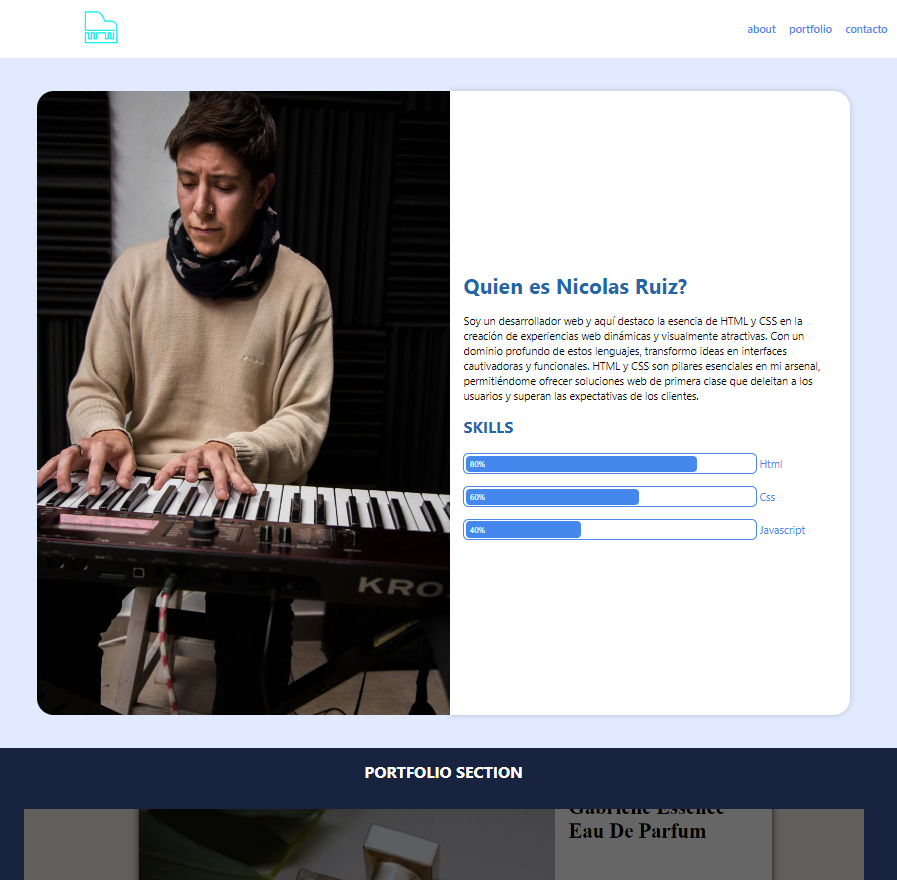

# Mi Proyecto

## Imagen desde el repositorio

Este es el archivo README para mi proyecto.

## Enlace a la página web

Puedes ver la página web del proyecto [aquí](https://nicolasruizh.github.io/blue-habilty-bar/).